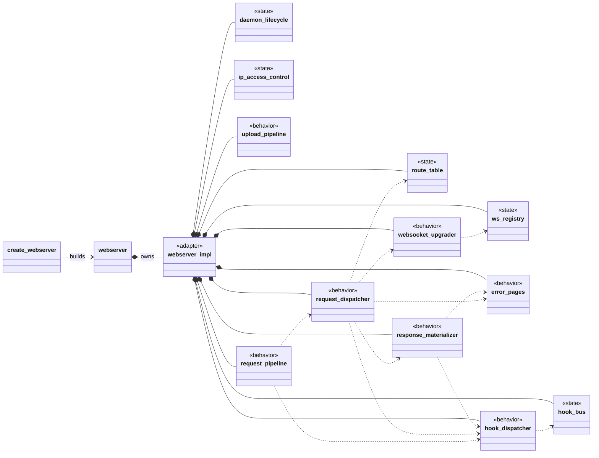
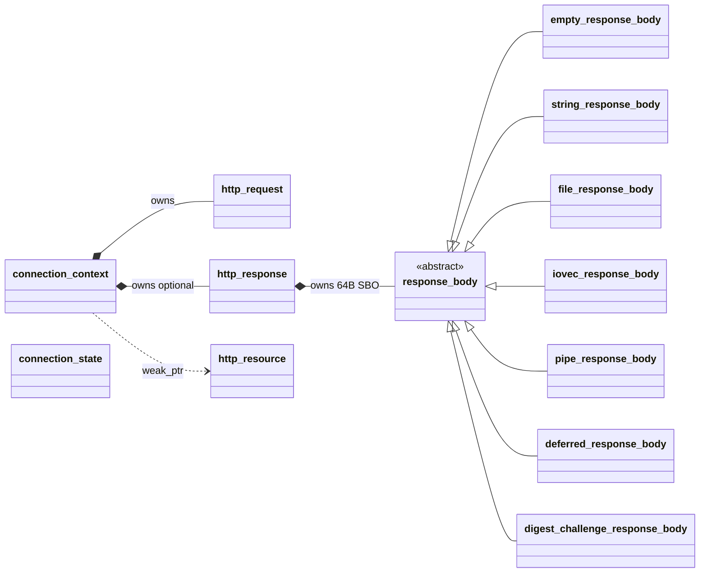
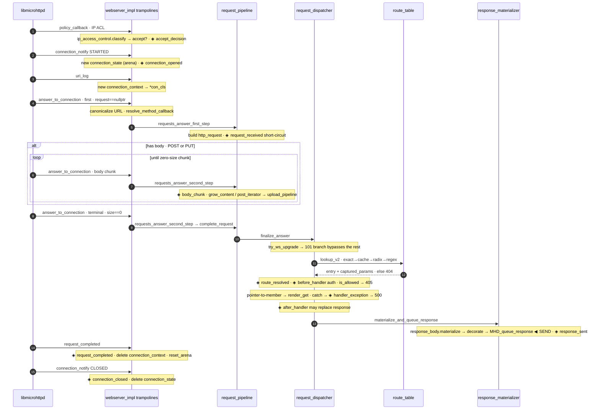
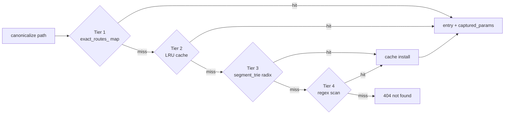

# libhttpserver v2.0 — architecture diagrams

Architecture references for the v2.0 (`feature/v2.0`) codebase.

**Two hero diagrams** — spatial maps, best viewed as the rich self-contained HTML (no external assets, light/dark aware); Mermaid quick-views render inline below.

| Diagram | GitHub-native | Rich page |
|---|---|---|
| **Class, relationship & filesystem map** | [Mermaid ↓](#1-class-relationship--filesystem-map) | [`class-map.html`](class-map.html) |
| **Request lifecycle & routing flow** | [Mermaid ↓](#2-request-lifecycle--routing-flow) | [`request-flow.html`](request-flow.html) |

**Four deep dives** — reference-heavy topics, as Markdown (Mermaid + tables, render inline on GitHub).

| Doc | For | Covers |
|---|---|---|
| [**threading.md**](threading.md) | contributors | DR-008 concurrency contract, full mutex inventory, lock ordering, Helgrind lane |
| [**errors.md**](errors.md) | contributors | DR-009 propagation, every 4xx/5xx origin, the handler-exception path, config knobs |
| [**hooks.md**](hooks.md) | API users | the 11 phases, context fields, short-circuit vs observe, `hook_handle`, recipes |
| [**features.md**](features.md) | packagers / API users | `HAVE_*` detection, gated symbols, `features()`, `feature_unavailable`, build matrix |

> **Colour language** (shared by both diagrams): composition-root = blue · state collaborator = amber · behavior service = teal · MHD C-ABI adapter = purple · domain / value type = slate.

---

## 1. Class, relationship & filesystem map

Post-**DR-014**, `webserver` is a thin façade over `webserver_impl`, which is a **pure composition root** holding **5 state collaborators** (own their mutexes + data) and **7 behavior services** (stateless; hold `const&` into state and each other), plus a **static MHD adapter facet** (the C-ABI trampolines). Ownership is strictly linear and top-down; services form an acyclic DAG with no back-pointer (the sole exception: `daemon_lifecycle` needs `webserver_impl*` to read broad config while building the MHD option array).

Stereotypes below encode the role: `<<state>>` = state collaborator (owns mutex + data), `<<behavior>>` = behavior service (stateless), `<<adapter>>` = MHD C-ABI facet. Solid diamond (`*--`) = owns by value; dashed arrow (`..>`) = holds `const&` reference.

`daemon_lifecycle` (HAVE_WEBSOCKET builds also wire `ws_registry` + `websocket_upgrader`) — `route_table` owns `route_entry` / `segment_trie` / `route_cache`; `hook_bus` holds the 11 server-wide phase vectors; `response_materializer` turns `http_response` into an `MHD_Response`; `request_pipeline` is the re-entrant body-accumulation state machine. Full descriptions and per-class file locations: [`class-map.html`](class-map.html).

**Per-request / per-connection state** (threaded through the services):

**Filesystem convention.** Public surface in `src/httpserver/` (installed); internal detail headers in `src/httpserver/detail/` (never installed); implementations in `src/` and `src/detail/`. `webserver` = one façade TU (`src/webserver.cpp`); `webserver_impl` = two TUs (`src/detail/webserver_impl.cpp` composition root + `src/detail/webserver_callbacks.cpp` MHD adapter). The full per-class header/cpp locations are in [`class-map.html`](class-map.html).

---

## 2. Request lifecycle & routing flow

One HTTP request is not one function call. libmicrohttpd drives the exchange through a fixed sequence of C-ABI callbacks (static `webserver_impl` trampolines in `webserver_callbacks.cpp`), each forwarding into a behavior service. `answer_to_connection` is called **1..N times** — once for a bodyless `GET`, many times while a `POST` body streams in — but resolves to exactly one `finalize_answer`.

**Four-tier route resolution** (`route_table::lookup_v2`, cheapest first, first hit wins):

The entry is returned **regardless of method** so the 405 path still sees it. Method → handler is chosen separately: the verb became a pointer-to-member (`render_get`/`render_post`/…) in `resolve_method_callback`, and `dispatch_resource_handler` checks `http_resource::is_allowed(method_enum)` → mismatch yields **405** + the resource's `Allow:` header.

### The 11 hook phases (firing order)

Server-wide hooks live on `hook_bus`; the five post-route-resolution phases are also **per-resource** (`resource_hook_table`, via `http_resource::add_hook`). Every phase is guarded by a relaxed-atomic `has_hooks_for` check — zero cost when unused.

| # | Phase | Fires in | Scope | Kind |
|---|---|---|---|---|
| 1 | `connection_opened` | `connection_notify` STARTED | server | observe |
| 2 | `accept_decision` | `policy_callback` | server | observe |
| 3 | `request_received` | `requests_answer_first_step` | server | short-circuit |
| 4 | `body_chunk` | `requests_answer_second_step` (per chunk) | server | short-circuit |
| 5 | `route_resolved` | `finalize_answer` (after lookup) | server | observe |
| 6 | `before_handler` | `finalize_answer` (pre-dispatch · **auth**) | server + route | short-circuit |
| 7 | `handler_exception` | `dispatch_resource_handler` catch | server + route | short-circuit |
| 8 | `after_handler` | `finalize_answer` (post-handler) | server + route | replace resp |
| 9 | `response_sent` | `materialize_and_queue` (after queue) | server + route · log_access alias | observe |
| 10 | `request_completed` | `request_completed` callback | server + route | observe |
| 11 | `connection_closed` | `connection_notify` CLOSED | server | observe |

---

## Keeping these current

These diagrams describe `feature/v2.0` as of the DR-014 decomposition. When the composition root's collaborators, the callback spine, the route tiers, or the hook phases change, update **both** the Mermaid blocks above and the corresponding `.html` page (they are hand-authored, not generated). The rich pages are also published as live Claude artifacts — see the team's shared links.
