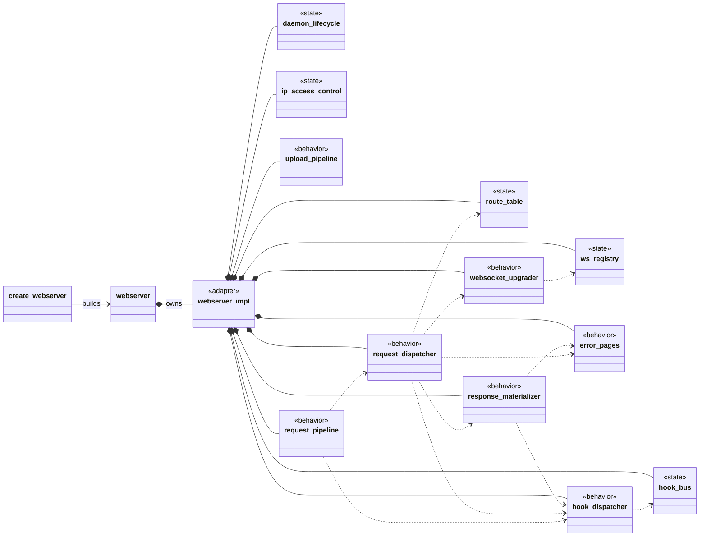
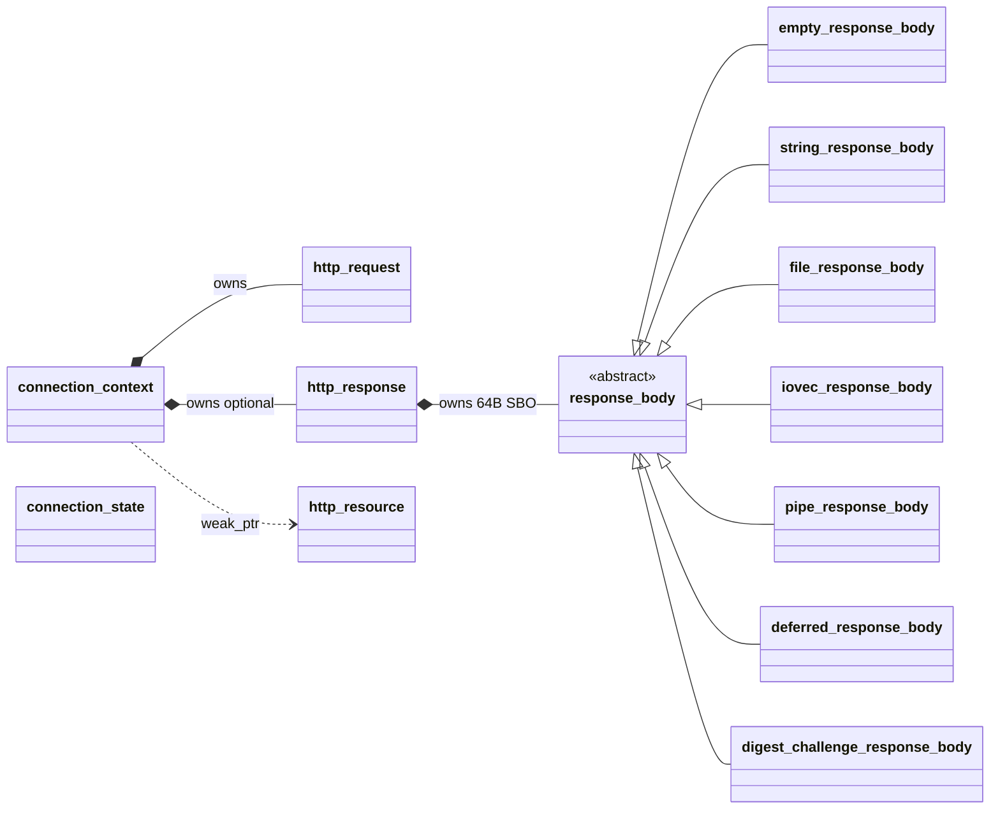

# Class, relationship & filesystem map

> How the classes fit together and where they live on disk, for libhttpserver v2.0.
> Quick-view below; the full colour-coded page with every class card and file location is **[`class-map.html`](class-map.html)** (open in a browser).

Post-**DR-014**, `webserver` is a thin façade over `webserver_impl`, which is a **pure composition root** holding **5 state collaborators** (own their mutexes + data) and **7 behavior services** (stateless; hold `const&` into state and each other), plus a **static MHD adapter facet** (the C-ABI trampolines). Ownership is strictly linear and top-down; services form an acyclic DAG with no back-pointer (the sole exception: `daemon_lifecycle` needs `webserver_impl*` to read broad config while building the MHD option array).

> **Colour language** (used by the HTML pages): composition-root = blue · state collaborator = amber · behavior service = teal · MHD C-ABI adapter = purple · domain / value type = slate.

## Composition backbone

Stereotypes encode the role: `<<state>>` = state collaborator (owns mutex + data), `<<behavior>>` = behavior service (stateless), `<<adapter>>` = MHD C-ABI facet. Solid diamond (`*--`) = owns by value; dashed arrow (`..>`) = holds `const&` reference.

`ws_registry` + `websocket_upgrader` are wired only on `HAVE_WEBSOCKET` builds. `route_table` owns `route_entry` / `segment_trie` / `route_cache`; `hook_bus` holds the 11 server-wide phase vectors; `response_materializer` turns `http_response` into an `MHD_Response`; `request_pipeline` is the re-entrant body-accumulation state machine. The mutexes each state collaborator owns are catalogued in [threading.md](threading.md).

## Per-request / per-connection state

The objects threaded through the services during a request:

`connection_context` is MHD's `*con_cls` (the dispatch blackboard, allocated in `uri_log`); `connection_state` is MHD's `socket_context` (the per-keep-alive-connection PMR arena). `http_response` stores one `response_body` subclass inline in a 64-byte SBO buffer.

## Filesystem convention

Public surface in `src/httpserver/` (installed); internal detail headers in `src/httpserver/detail/` (never installed); implementations in `src/` and `src/detail/`. `webserver` = one façade TU (`src/webserver.cpp`); `webserver_impl` = two TUs (`src/detail/webserver_impl.cpp` composition root + `src/detail/webserver_callbacks.cpp` MHD adapter). Both `webserver.cpp` and `webserver_callbacks.cpp` sit under the 600-SLOC façade/adapter carve-out of the `check-file-size` gate (others: 500). The full per-class header/cpp locations are in [`class-map.html`](class-map.html).

---
*See also: [request-flow](request-flow.md) (how these classes collaborate per request) · [threading.md](threading.md) (the mutexes they own).*
