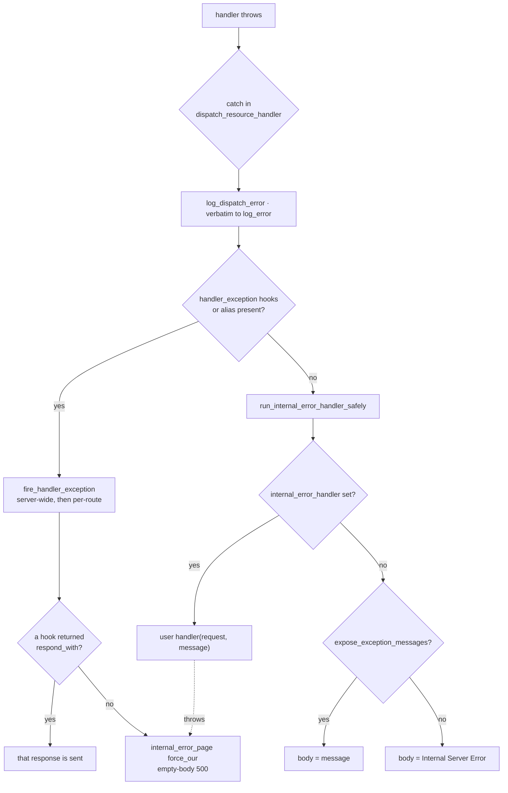

# Error propagation & status codes (DR-009)

> Where every error status comes from, how handler exceptions become responses, and what you can customize.
> Decision record: [`specs/architecture/11-decisions/DR-009.md`](../../specs/architecture/11-decisions/DR-009.md) · cross-cutting §5.2: [`05-cross-cutting.md`](../../specs/architecture/05-cross-cutting.md).

## The contract

DR-009 chose **Option 1 — no throw-as-status idiom.** There is no `http_error` type. To return a 404/400 you build a response by value:

```cpp
return http_response::empty().with_status(404);
```

Any **uncaught exception** from a handler becomes a **500**, routed through an optional `internal_error_handler` escape hatch. The six-point rule:

1. Handler throws `std::exception` → caught, logged via `log_error`, `internal_error_handler` invoked with `e.what()`. **Default body is the fixed string `"Internal Server Error"`** (CWE-209) — the verbatim message reaches only the log and a configured handler.
2. Handler throws non-`std::exception` → `catch (...)`, message sentinel `"unknown exception"`, same fixed default body.
3. Library-internal dispatch exception (allocation, body materialization) → same path.
4. `internal_error_handler` itself throws → logged, hardcoded **empty-body 500**.
5. `feature_unavailable` is a plain `std::runtime_error` — no special status mapping.
6. No throw-as-status.

**No-throw boundary:** the exception→status translation is entirely internal C++; nothing new crosses the ABI. A response always reaches MHD — the four terminal producers are `noexcept` or exception-contained.

## Status origins

| Status | Producer | Trigger | Customize with |
|---|---|---|---|
| **404** | `error_pages::not_found_page` | route lookup miss in `finalize_answer` (also the `invalid_argument` fallback arm of `get_raw_response_with_fallback`) | `not_found_handler` |
| **405** | `error_pages::method_not_allowed_page` | `is_allowed(method)` false in `dispatch_resource_handler`; `Allow:` header from `hrm->get_allow_header()` | `method_not_allowed_handler` |
| **500** (default `"Internal Server Error"`) | `error_pages::internal_error_page` (`force_our=false`) | handler/dispatch exception, null-materialize, `-1` sentinel response | `internal_error_handler`, `expose_exception_messages` |
| **500** (body = `e.what()`) | same, when `expose_exception_messages==true` | dev opt-in only | — |
| **500** (hardcoded empty body) | `internal_error_page(force_our=true)` | double-fault: user handler threw, or belt-and-suspenders sites | — |
| **401** (Basic / scheme) | `http_response::unauthorized(scheme, realm, body)` | user-returned; builds `WWW-Authenticate: <scheme> realm="…"` (control-char rejection, quoted-string escaping) | your handler |
| **401** (Digest) | `http_response::unauthorized(digest_challenge)` → `MHD_queue_auth_required_response3` | user-returned; `body_kind::digest_challenge` (needs `HAVE_DAUTH`) | your handler |
| **400** (bad WS handshake) | `websocket_upgrader::try_handle` | `Upgrade: websocket` present but `validate_websocket_handshake` fails (bad `Connection` / `Sec-WebSocket-Version` ≠ 13 / empty key) | — |
| **101** (success, not an error) | `complete_websocket_upgrade` | successful WebSocket upgrade | — |

Default bodies (`constants.hpp`): `"Not Found"`, `"Method not Allowed"`, `"Internal Server Error"`.

## The handler-exception path



Notable details:

- **`-1` sentinel:** `http_response::status_code_` defaults to `-1`. A returned response with `get_status()==-1` is treated as null and rerouted through `run_internal_error_handler_safely(…, "handler returned null response")`.
- **A throwing `handler_exception` hook does not abort the chain** — it is logged and the next hook runs (the chain's job is recovery). Every *other* phase's throwing hook is routed back through the normal DR-009 500 path.
- **`run_internal_error_handler_safely`** wraps the user `internal_error_handler` in try/catch; if it throws, it logs and falls back to the hardcoded empty-body 500. No exception escapes.
- **`log_dispatch_error`** (`noexcept`) is the single internal logging channel: no-op if `log_error` is unset, otherwise forwards the message **verbatim** (flag-independent) inside a `try/catch` that swallows a misbehaving logger.

## Configuration

| Knob | Signature / default | Effect |
|---|---|---|
| `not_found_handler` | `std::function<http_response(const http_request&)>`, default none | replaces the 404 body |
| `method_not_allowed_handler` | `std::function<http_response(const http_request&)>`, default none | replaces the 405 body (`Allow:` still added) |
| `internal_error_handler` | `std::function<http_response(const http_request&, std::string_view message)>`, default none | invoked with the originating message for 500 |
| `expose_exception_messages` | `bool`, default `false` | **dev only** — default-500 body becomes the originating message instead of `"Internal Server Error"` (CWE-209) |
| `expose_credentials_in_logs` | `bool`, default `false` | when `true`, `http_request::operator<<` streams passwords / `Authorization` / cookies verbatim instead of `<redacted>` (CWE-312/532) |

**Message-exposure matrix:** the verbatim message always goes to `log_error` and to a configured `internal_error_handler`; it reaches the **wire** only under `expose_exception_messages(true)`.

## `feature_unavailable`

`class feature_unavailable : public std::runtime_error` — always compiled, regardless of `HAVE_*`. Thrown when a feature-gated API is used on a build without that feature (see [features & build matrix](features.md)). Its reach depends on the call site:

- Thrown at **`webserver` construction** or from **setup / registration** APIs → propagates to the **caller** (your application code).
- Thrown from **inside a handler** (e.g. `unauthorized(digest_challenge)` on a non-digest build, or a `websocket_session` send) → it is a normal `std::exception` on the dispatch path → generic **500** to the client, unless an `internal_error_handler` special-cases it.

---
*See also: [request-flow](request-flow.md) (where 404/405/500 sit in the dispatch sequence) · [hooks cookbook](hooks.md) (the `handler_exception` phase).*
