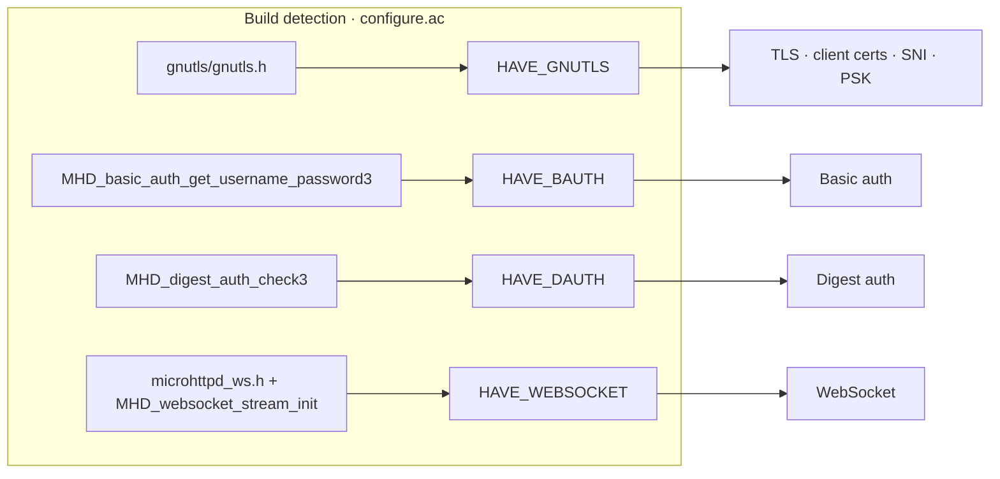

# Feature availability & build matrix

> Which capabilities compile in, how they're detected, and what happens when they're absent.
> Build & packaging spec: [`specs/architecture/08-build-and-packaging.md`](../../specs/architecture/08-build-and-packaging.md).

## The design rule

**The public symbol surface is identical on every build.** Every feature-gated method is always declared and linkable — only the method *body* branches on the build macro, either returning a documented sentinel or throwing `feature_unavailable`. The four `HAVE_*` macros are pushed via compiler `-D` flags (not a `config.h`), so no consumer include is required.

## The four features

| Feature | Detected by (`configure.ac`) | Gated symbols | `features()` bool | When absent |
|---|---|---|---|---|
| **TLS / HTTPS** | `AC_CHECK_HEADER(gnutls/gnutls.h)` → `HAVE_GNUTLS` | `http_request_impl_tls.cpp` (`get_tls_session`, `populate_all_cert_fields`), `http_request` cert accessors, `sni_credentials_cache`, `sni_cert_callback_func`, `psk_cred_handler_func`, GnuTLS MHD options | `tls` | `use_ssl(true)` → **ctor throws** `feature_unavailable("tls","HAVE_GNUTLS")`; cert accessors return `false`/empty/`-1`; `cred_type`/PSK/SNI options silently dropped |
| **Basic auth** | `AC_CHECK_LIB(microhttpd, MHD_basic_auth_get_username_password3)` → `HAVE_BAUTH` | `fetch_user_pass`, `get_user`/`get_pass` bodies | `basic_auth` | `basic_auth(true)` → **ctor throws** `("basic_auth","HAVE_BAUTH")`; `get_user`/`get_pass` → empty |
| **Digest auth** | `AC_CHECK_LIB(microhttpd, MHD_digest_auth_check3)` → `HAVE_DAUTH` | `digest_opaque_`, `check_digest_auth`, `check_digest_auth_digest`, `get_digested_user`, `unauthorized(digest_challenge)`, `digest_challenge_response_body`, digest MHD options | `digest_auth` | `digest_auth(true)` → **ctor throws** `("digest_auth","HAVE_DAUTH")`; `unauthorized(digest_challenge)` → throws same; `check_*` → `WRONG_HEADER`; `get_digested_user` → empty |
| **WebSocket** | `AC_CHECK_HEADER(microhttpd_ws.h)` + `AC_CHECK_LIB(microhttpd_ws, MHD_websocket_stream_init)` → `HAVE_WEBSOCKET` (adds `-lmicrohttpd_ws`) | `websocket_upgrader`, real `websocket_session`, `websocket_handler` hooks, populated `ws_registry`, `register_ws_resource`/`unregister_ws_resource`, `MHD_ALLOW_UPGRADE` | `websocket` | `register_ws_resource`/`unregister_ws_resource` **throw** `("websocket","HAVE_WEBSOCKET")`; session send/close throw same; handler hooks no-op |

Each macro is injected into `AM_CXXFLAGS`/`AM_CFLAGS` as `-D<MACRO>` (with a matching `AM_CONDITIONAL`); none is written to `config.h`.

### Other build-time switches

| Macro | Detection | Gates |
|---|---|---|
| `MHD_OPTION_HTTPS_CERT_CALLBACK` | MHD-provided | SNI callback wiring (additionally requires `HAVE_GNUTLS`) |
| `MHD_VERSION` | MHD header | `http_utils.cpp` compat shim for pre-0.9.74 status-code spellings |
| `HAVE_EXPLICIT_BZERO` | `AC_CHECK_DECLS([explicit_bzero])` | `secure_zero.hpp` implementation (internal) |
| `USE_FASTOPEN` | kernel `TCP_FASTOPEN` probe (`--enable-fastopen`) | `MHD_USE_TCP_FASTOPEN` daemon flag |

**Minimum libmicrohttpd: 1.0.0** — `configure.ac` hard-errors below `MHD_VERSION 0x01000000`.

## Runtime feature reporting

- **`webserver::features()`** (`noexcept`) returns `{basic_auth, digest_auth, tls, websocket}`, each a `constexpr` resolved purely from the build macros. It reflects the **library's** build flags, not the caller's — the body lives in `webserver.cpp` precisely so consumers see the shipped library's capabilities. It does **not** query MHD.
- **`http::http_utils::is_feature_supported(int)`** is the only *runtime* MHD query — wraps `MHD_is_feature_supported((enum MHD_FEATURE)…)`; independent of the four `HAVE_*` macros.
- **`http::http_utils::get_mhd_version()`** returns MHD's version string.

## `feature_unavailable` throw sites

`class feature_unavailable : public std::runtime_error` (always compiled). `what()` = `"feature '<feature>' unavailable: built without <build_flag>"`.

- `webserver::webserver` ctor — validated **lazily at construction** (never at the setter): `use_ssl` w/o GnuTLS, `basic_auth` w/o BAuth, `digest_auth` w/o DAuth.
- `http_response::unauthorized(digest_challenge)` w/o `HAVE_DAUTH`.
- `webserver::register_ws_resource` / `unregister_ws_resource` and every `websocket_session` send/close w/o `HAVE_WEBSOCKET`.

Setters never throw — they only mutate config; validation is deferred. So `use_ssl(true)` on a GnuTLS-off build compiles and returns fine, then throws when you construct the `webserver`.

## Builder setters that depend on a feature

| Setter | Feature | If feature absent |
|---|---|---|
| `use_ssl(bool)` | HAVE_GNUTLS | ctor throws |
| `https_mem_key/cert/trust` (+ `raw_*`), `https_mem_dhparams`, `https_key_password`, `https_priorities[_append]` | HAVE_GNUTLS (via `use_ssl`) | wired only under `use_ssl`; otherwise inert |
| `cred_type(cred_type_T)` | HAVE_GNUTLS | option added only under `HAVE_GNUTLS`; else ignored (ctor throws first if `use_ssl` also set) |
| `psk_cred_handler(cb)` | HAVE_GNUTLS + `use_ssl` | ignored otherwise |
| `sni_callback(cb)` | HAVE_GNUTLS + cert-callback + `use_ssl` | ignored otherwise |
| `digest_auth_random(str)`, `nonce_nc_size` | HAVE_DAUTH | option added only under `HAVE_DAUTH`; else ignored |
| `basic_auth(bool)` | HAVE_BAUTH | ctor throws if enabled |
| `digest_auth(bool)` | HAVE_DAUTH | ctor throws if enabled |

`basic_auth`/`digest_auth` default to `true` **only** when their macro is defined, so an auth-off build defaults the flag off and never throws spuriously.

## Build systems

- **Autotools is the only build with capability detection**: `configure.ac` + `src/Makefile.am`. All four `HAVE_*` and the switches above are probed here.
- **CMake support is consumer-side only**: `cmakemodule/FindLibHttpServer.cmake` is a plain find-module (locates headers + library); it does no capability detection and does not build the library. There is no top-level `CMakeLists.txt`.

---
*See also: [errors](errors.md) (`feature_unavailable`'s reach — caller vs client) · [class map](class-map.md) (the gated collaborators, marked `HAVE_WEBSOCKET`).*
