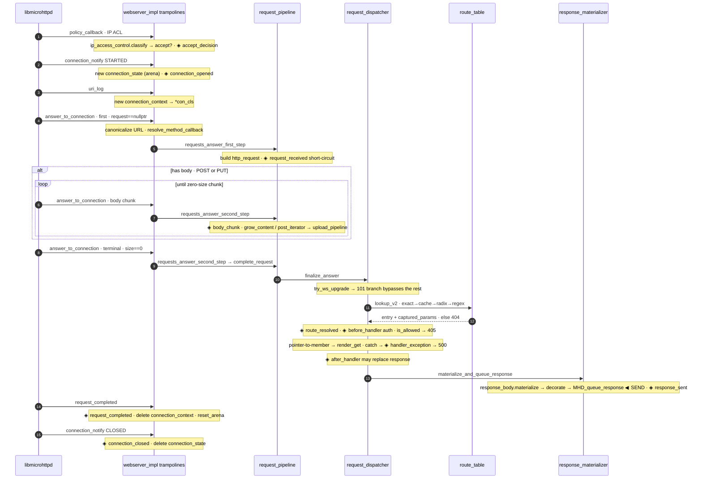
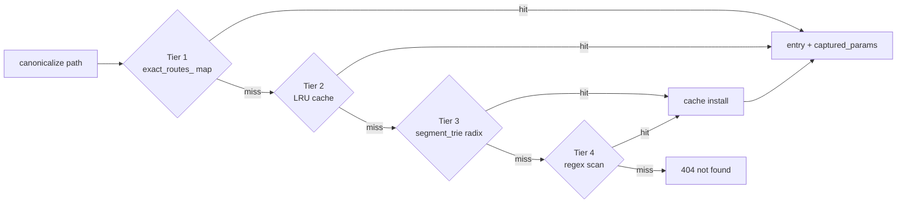

# Request lifecycle & routing flow

> How an HTTP request travels from the libmicrohttpd callback to the wire, for libhttpserver v2.0.
> Quick-view below; the full step-by-step page (28 ordered steps, the body loop, the WebSocket branch, the hook rail) is **[`request-flow.html`](request-flow.html)** (open in a browser).

One HTTP request is not one function call. libmicrohttpd drives the exchange through a fixed sequence of C-ABI callbacks (static `webserver_impl` trampolines in `webserver_callbacks.cpp`), each forwarding into a behavior service. `answer_to_connection` is called **1..N times** — once for a bodyless `GET`, many times while a `POST` body streams in — but resolves to exactly one `finalize_answer`.

## The callback spine

## Four-tier route resolution

`route_table::lookup_v2` — cheapest tier first, first hit wins:

The entry is returned **regardless of method** so the 405 path still sees it. Method → handler is chosen separately: the verb became a pointer-to-member (`render_get`/`render_post`/…) in `resolve_method_callback`, and `dispatch_resource_handler` checks `http_resource::is_allowed(method_enum)` → mismatch yields **405** + the resource's `Allow:` header.

## Where the hook phases fire

Server-wide hooks live on `hook_bus`; the five post-route-resolution phases are also **per-resource** (`resource_hook_table`, via `http_resource::add_hook`). Every phase is guarded by a relaxed-atomic `has_hooks_for` check — zero cost when unused. The full context-struct catalog and usage recipes are in **[hooks.md](hooks.md)**.

| # | Phase | Fires in | Scope | Kind |
|---|---|---|---|---|
| 1 | `connection_opened` | `connection_notify` STARTED | server | observe |
| 2 | `accept_decision` | `policy_callback` | server | observe |
| 3 | `request_received` | `requests_answer_first_step` | server | short-circuit |
| 4 | `body_chunk` | `requests_answer_second_step` (per chunk) | server | short-circuit |
| 5 | `route_resolved` | `finalize_answer` (after lookup) | server | observe |
| 6 | `before_handler` | `finalize_answer` (pre-dispatch · **auth**) | server + route | short-circuit |
| 7 | `handler_exception` | `dispatch_resource_handler` catch | server + route | short-circuit |
| 8 | `after_handler` | `finalize_answer` (post-handler) | server + route | replace resp |
| 9 | `response_sent` | `materialize_and_queue` (after queue) | server + route · log_access alias | observe |
| 10 | `request_completed` | `request_completed` callback | server + route | observe |
| 11 | `connection_closed` | `connection_notify` CLOSED | server | observe |

---
*See also: [class map](class-map.md) (the classes on each lane) · [hooks.md](hooks.md) (the hook cookbook) · [errors.md](errors.md) (the 404/405/500 origins).*
