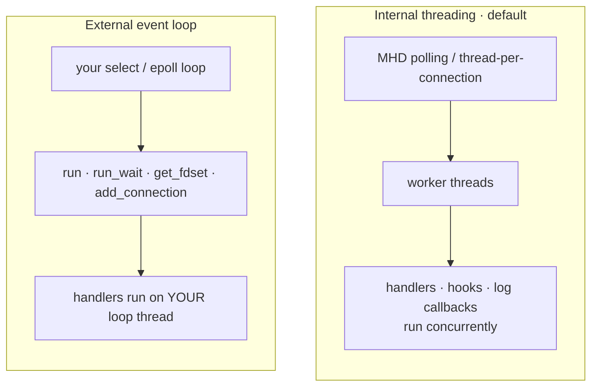
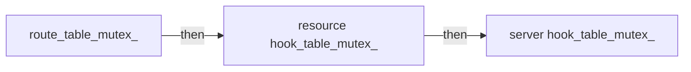

# Threading & locking model (DR-008)

> Concurrency contract, mutex inventory, and lock ordering for libhttpserver v2.0.
> Decision record: [`specs/architecture/11-decisions/DR-008.md`](../../specs/architecture/11-decisions/DR-008.md) · cross-cutting §5.1 / §5.6: [`05-cross-cutting.md`](../../specs/architecture/05-cross-cutting.md).

## The contract

DR-008 chose **Option 1 — internally synchronized, fully re-entrant**. Every `webserver` public method is thread-safe and may be called *from inside a handler*, including live route (un)registration, IP allow/deny, and hook registration.

- **Handlers run concurrently** on MHD worker threads — the same lambda / `http_resource` / hook is invoked from many threads at once. **Your own state must be user-synchronized.**
- `http_request` is **single-threaded per request** — owned by the servicing worker, must not outlive the handler return or be shared across threads (UB).
- `http_response` is a **move-only value type**; returning it transfers ownership.
- **The one exception to "call anything, anytime":** `stop()`, `stop_and_wait()`, and `~webserver()` **must not be called from a handler thread** — they join MHD's workers (the very thread calling them) and will deadlock, or abort with *"Failed to join a thread."* on some MHD builds. Call them from the thread that owns the server.
- **Cache-staleness caveat:** the route LRU cache is consulted *outside* `route_table_mutex_`, so a request that hit the cache can still be served by a just-unregistered resource. This is not use-after-free (the cache holds a `shared_ptr`); the single response is merely logically stale.

Verified by `test/integ/threadsafety_stress.cpp` under the **TSan** CI lane (16 curl clients × 60 s mutating routes/IPs from handler threads), plus the opt-in `stop_from_handler_deadlocks_as_documented` negative test.

## Two threading models

- **Internal** (default; `start_method`, `max_threads`): MHD owns the threads. `max_threads != 0` adds `MHD_OPTION_THREAD_POOL_SIZE`. All user callbacks — render methods, hooks, `log_access`/`log_error`, error handlers, PSK/SNI/ALPN, `file_cleanup` — run on MHD workers, concurrently.
- **External**: start without internal threads and drive with `run()` / `run_wait(ms)` / `get_fdset()` + `get_timeout()` / `add_connection()`. Dispatch runs on **your** loop thread; `run()`/`run_wait()` catch handler exceptions internally.
- **`daemon_lifecycle` start/stop handshake** uses POSIX primitives (`mutexwait`/`mutexcond`, `pthread_*`) rather than `std::` because MHD's start path expects them. On a blocking `start()` the caller `pthread_cond_wait`s until `stop()` flips `running=false` and signals.

## Mutex inventory

Each state collaborator owns its own mutex(es); **no lock nests with another across a call-out** (see below). `shared_mutex` gives many-reader / one-writer.

| Owner | Member | Type | Guards | Read / write |
|---|---|---|---|---|
| `route_table` | `route_table_mutex_` | `shared_mutex` | the 3 route tiers (`exact_routes_`, `param_and_prefix_routes_` trie, `regex_routes_`) | lookup = `shared`; (un)register = `unique` via `lock_for_write()` |
| `route_cache` | `mutex_` | `mutex` | LRU list + index (every touch splices → a write) | `lock_guard` on every access |
| `hook_bus` | `hook_table_mutex_` | `shared_mutex` | the 11 server-wide phase vectors | add/remove = `unique`; fire = `shared` (snapshot + release) |
| `hook_bus` | `any_hooks_[11]`, `next_slot_id_` | `atomic<bool>[]`, `atomic<u64>` | hot-path skip gate; slot allocator | relaxed load on dispatch; set under `unique` |
| `resource_hook_table` | `hook_table_mutex_` | `shared_mutex` | the 5 per-resource phase vectors | append/remove = `unique`; fire = `shared` |
| `ip_access_control` | `deny_list_mutex_` | `shared_mutex` | `deny_list_` | mutate = `unique`; `classify` = `shared` |
| `ip_access_control` | `allow_list_mutex_` | `shared_mutex` | `allow_list_` | mutate = `unique`; `classify` = `shared` |
| `ws_registry` | `mutex_` | `shared_mutex` | `handlers_` map | (un)register = `unique`; `find`/`empty` = `shared` |
| `daemon_lifecycle` | `mutexwait` / `mutexcond` | `pthread_mutex_t` / `pthread_cond_t` | blocking start/stop handshake | raw `pthread_*` |
| `daemon_lifecycle` | `daemon`, `running` | `atomic<MHD_Daemon*>`, `atomic<bool>` | published handle + ephemeral port; started flag | release/acquire; lock-free reads |
| `http_resource` | `cached_allow_mutex_` | `mutable shared_mutex` | **only** the lazy `Allow:`-header cache (`cached_allow_header_/mask_/valid_`) — *not* `methods_allowed_` | warm read = `shared`; fill = `unique` (double-checked) |
| `http_resource` | `hook_table_` | `shared_ptr` via `std::atomic_*` | lock-free publication of the per-resource hook table | `atomic_load(acquire)` / CAS(acq_rel) |
| `webserver_impl` | `sni_credentials_mutex` | `mutable shared_mutex` *(HAVE_GNUTLS + cert-callback)* | `sni_credentials_cache` | read = `shared`; fill = `unique` |

`http_request_impl` has **no mutex** — single-threaded per request by contract. `segment_trie` has none — it is covered by the owning `route_table_mutex_`.

## The "no two locks co-held" invariant

Two facts hold together:

1. **The clusters are disjoint.** IP-ACL, `ws_registry`, and SNI mutexes are never taken with any other cluster's lock. The single deliberate intra-class co-hold is `ip_access_control::classify()`, which takes **both** `deny_list_mutex_` and `allow_list_mutex_` as `shared_lock`, always **deny-then-allow**, for a consistent snapshot — never with any third mutex held.
2. **The two nesting families have a documented order — but never hold two across a call-out.** Each site takes a lock, *snapshots* the data, *releases*, then acts. This release-before-acquire is exactly what makes `add_hook` / `hook_handle::remove` safe to call from inside a running hook.

- **Route family:** `route_table_mutex_` before `route_cache::mutex_` — but lookup releases the table lock *then* promotes into the cache; registration releases *then* clears it.
- **Hook family:** `route_table_mutex_` → resource `hook_table_mutex_` → server `hook_table_mutex_`. Each firing site copies the phase vector under a `shared_lock`, releases, then invokes user code with no lock held.

TSan-validated by `threadsafety_stress.cpp` and the `check-route-table-concurrency` lane.

## Public-API concurrency

| Safe from any thread, incl. inside a handler | Must be called only from the owning thread |
|---|---|
| `register_path` · `register_prefix` · `on_get`/`on_post`/… · `route` | `stop()` |
| `unregister_path` · `unregister_prefix` · `unregister_resource` | `stop_and_wait()` |
| `register_ws_resource` · `unregister_ws_resource` | `~webserver()` |
| `deny_ip` · `remove_denied_ip` · `allow_ip` · `remove_allowed_ip` | |
| `add_hook` · `http_resource::add_hook` · `hook_handle::remove` | |

A duplicate registration from a handler throws `std::invalid_argument` — no data race. Lifecycle atomics: `running` lets `is_running()`/`stop()` read lock-free while start/stop writes under the mutex; `daemon` (release/acquire) publishes the handle and ephemeral bind port so `get_bound_port()` is safe on another thread during a blocking `start()`.

## Helgrind lane

Policy (mirrors DR-008): **any race Helgrind reports inside libhttpserver's own locking is a real bug — fix the source, never suppress it.** Only narrow, per-symbol, third-party or provably-benign entries are allowed in [`test/valgrind-helgrind.supp`](../../test/valgrind-helgrind.supp) — never a `...` wildcard spanning a library locking frame.

The false positives come from MHD signalling its workers over an **internal ITC pipe** (not a pthread primitive), which Helgrind's `--history-level=approx` cannot see as a happens-before — so it flags benign races on MHD worker frames, immutable-after-start config reads, and state published via the HTTP round-trip. **DR-014 split dispatch into its own TUs, changing inlining and lifting the write frames**, which forced re-anchoring those suppressions on the **test-fixture handler symbol** (e.g. `*print_request_resource*render_get*`) rather than any library frame — so a genuine library race stays unsuppressed. `scripts/check-dr008-lanes.sh` is a structural gate asserting the two DR-008 CI steps (`check-route-table-concurrency` on TSan, `check-stop-from-handler` on the baseline lane) are never silently dropped. TSan (precise) is green across all of these.

---
*See also: [request-flow](request-flow.html) (which callbacks run on which thread) · [class map](class-map.html) (the collaborators that own these mutexes).*
